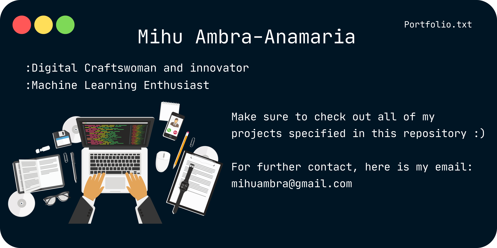

# Welcome to Ambra's Portfolio Repository 

Welcome to my portfolio repository! Here, I've curated a collection of small projects that demonstrate my skills, creativity, and potential as a working professional. Each project showcases a unique aspect of my abilities and passion for Machine Learning, Deep Learning, Low Level Programming and Software development.

## About Me

I'm a second year Computer Science undergraduate at the Vrije Universiteit Amsterdam with a deep curiosity for cutting-edge technologies and a drive to create meaningful solutions. My journey in the field of engineering and innovation has given me the tools to approach challenges with an out of the ordinary way of thinking and a commitment to continuous learning.

## Projects

### [Project 1 : CogniCraft Ai]

                                      **under maintenance** 

- **Description:** CogniCraft is a self-developed project that is meant to empower businesses with cutting-edge AI solutions, revolutionizing processes, enhancing customer experiences, and uncovering new opportunities.
- **Technologies:** Technologies used in this project include Python, Tensorflow.
- **Demo:** Currently not available.

### [Project 2: IJVM Emulator]

- **Description:** This project, undertaken during my final semester of the first year of my computer science degree, delves into the complexities of emulating the Improved Java Virtual Machine (IJVM). This project is an in-depth exploration of the IJVM's instruction set, stack-based architecture and memory management model.
- **Technologies:** C programming language, x86 Assembly, Memory Management
- **Challenges:** As a first-year endeavor, I grappled with mastering C syntax, deciphering bytecode and x86 assembly, managing dynamic memory, and embracing the intricacies of a stack-based architecture.
- **Ways of coping with them:**
- 🚀Understanding the way binaries work and how to parse them in useful blocks of data
- 🚀Using practical examples and logical analysis when working with dynamic memory (also being very careful where I allocate memory 😄 )
- 🚀Thoroughly studying the multiple implementations of a stack and how its logic fundamentally sustains the entire project
- **Demo:** 

### [Project Name 3: Creative Project Title]

- **Description:** Explain how this project demonstrates creativity and problem-solving.
- **Technologies:** List the technologies and tools used (e.g., Unity, C#, Blender).
- **Demo:** Provide a link to a live demo or project repository.

## Skills

- **Programming Languages:** List programming languages you're proficient in (e.g., Python, JavaScript).
- **Technologies:** Mention frameworks, libraries, and tools you've used (e.g., React, Node.js, Git).
- **Problem-Solving:** Highlight your ability to tackle complex problems and find efficient solutions.

## Contact

I'm excited about potential collaborations and opportunities. Let's connect:
- LinkedIn: [Your LinkedIn Profile](https://www.linkedin.com/in/yourusername/)
- Email: [Your Email Address](mailto:your.email@example.com)
- Twitter: [@YourUsername](https://twitter.com/yourusername)

## Future Endeavors

While these projects represent a snapshot of my capabilities, I'm enthusiastic about the potential for growth and exploration. I'm actively seeking opportunities that challenge and inspire me to contribute to innovative solutions in [Your Field].

---

*This portfolio is licensed under [MIT License](LICENSE). Feel free to explore, learn, and adapt the code as needed.*
