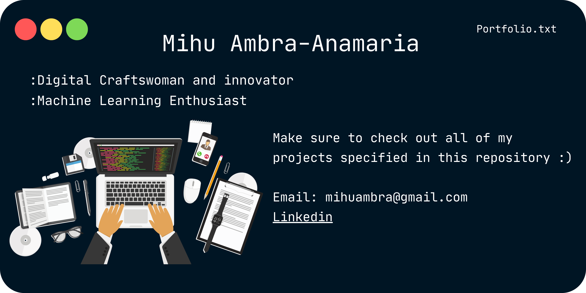

# Portfolio: Small Projects with Big Potential

Welcome to my portfolio repository! Here, I've curated a collection of small projects that demonstrate my skills, creativity, and potential as a [Your Profession, e.g., Software Developer]. Each project showcases a unique aspect of my abilities and passion for [Your Field of Interest, e.g., Web Development, Data Science, etc.].

## About Me

I'm a [Your Year of Study, e.g., Second-Year] [Your Major/Program, e.g., Computer Science] student with a deep curiosity for cutting-edge technologies and a drive to create meaningful solutions. My journey in [Your Field] has given me the tools to approach challenges with innovative solutions and a commitment to continuous learning.

## Projects

### [Project Name 1: Catchy Project Title]

- **Description:** A brief overview of the project's purpose and features.
- **Technologies:** List the technologies and tools used (e.g., HTML, CSS, JavaScript, React).
- **Demo:** Provide a link to a live demo or project repository.

### [Project Name 2: Impactful Project Title]

- **Description:** Highlight the unique features and impact of the project.
- **Technologies:** List the technologies and tools used (e.g., Python, Flask, PostgreSQL).
- **Demo:** Provide a link to a live demo or project repository.

### [Project Name 3: Creative Project Title]

- **Description:** Explain how this project demonstrates creativity and problem-solving.
- **Technologies:** List the technologies and tools used (e.g., Unity, C#, Blender).
- **Demo:** Provide a link to a live demo or project repository.

## Skills

- **Programming Languages:** List programming languages you're proficient in (e.g., Python, JavaScript).
- **Technologies:** Mention frameworks, libraries, and tools you've used (e.g., React, Node.js, Git).
- **Problem-Solving:** Highlight your ability to tackle complex problems and find efficient solutions.

## Contact

I'm excited about potential collaborations and opportunities. Let's connect:
- LinkedIn: [Your LinkedIn Profile](https://www.linkedin.com/in/yourusername/)
- Email: [Your Email Address](mailto:your.email@example.com)
- Twitter: [@YourUsername](https://twitter.com/yourusername)

## Future Endeavors

While these projects represent a snapshot of my capabilities, I'm enthusiastic about the potential for growth and exploration. I'm actively seeking opportunities that challenge and inspire me to contribute to innovative solutions in [Your Field].

---

*This portfolio is licensed under [MIT License](LICENSE). Feel free to explore, learn, and adapt the code as needed.*
